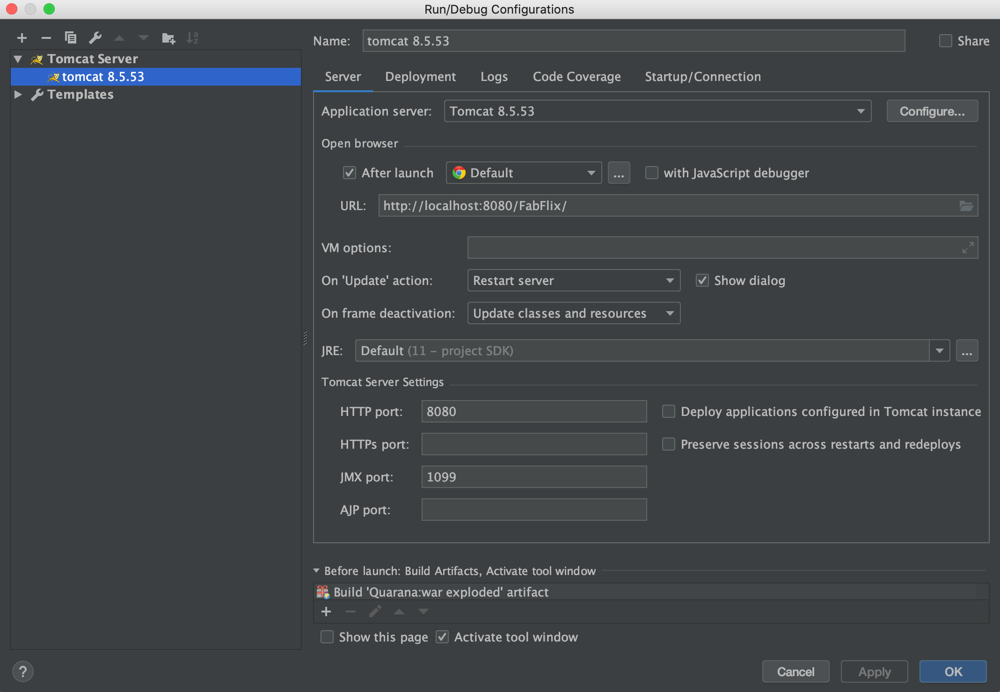

# Authors: [Nisarg Shah](https://github.com/nshah9856), [Joanna Ko](https://github.com/joannatko)
## Demo Video
- View our Project 1 Demo Video here: https://www.youtube.com/watch?v=OlU795mq0hg
- View our Project 2 Demo Video here: https://www.youtube.com/watch?v=SDhbaxUaCQI
```diff
! View our Project 3 Demo Video here: 
```
 https://www.youtube.com/watch?v=PhrO_PNp6J4
 

## Deploy FabFlix (Remotely)
1. Git clone repository: `git clone https://github.com/UCI-Chenli-teaching/cs122b-spring20-team-46/`

2. Change directory into repo: `cd cs122b-spring20-team-46`

3. Build war file: `mvn package`

4. Copy the war file into tomcat: `cp ./target/*.war /home/ubuntu/tomcat/webapps`

5. Open Tomcat Domain at *\<your-amazon-instance-domain\>:8080*

6. Go to Manager Apps > Click FabFlix

You should now be on the movie list page.

## Deploy FabFlix (Locally on Development Machine)
### Git clone repository
`git clone https://github.com/UCI-Chenli-teaching/cs122b-spring20-team-46/`

### IntelliJ Configuration
Import Project from External Model > Choose Maven

### To Connect Tomcat 
1. Click `Add Configurations` / `Edit Configurations`
2. Fix button should appear at bottom right screen 
3. Click `FabFlix:war exploded`
4. Apply changes and click `OK`
5. Click `Run` application to build, connect server and launch Tomcat.



You are now all set up! Visit FabFlix on at `http://localhost:8080/FabFlix`.

## Substring Matching Design
Used the following from Instructions on P2 Task 2 (`LIKE`)

Mainly our `LIKE` statements reside under `SearchServlet.java` files, but there is also a replicatino (not exactly the same) under `PageCountServlet.java` to make sure we are fetching the correct # of pages.

For example: `where title like ? "AND year like ? AND director like ?` -- This is the format adapted in the file and `?` if replaced with parameter setting (`PreparedStatement`)

# Project 3 - 

#### NOTE: To go back from dashboard to FabFlix go to /FabFlix/mainPage.html 

## Inconsistences 
  We have written two files [inconsistentGenreInMovies.md](https://github.com/UCI-Chenli-teaching/cs122b-spring20-team-46/blob/master/Parser/inconsistentGenreInMovies.md) and [inconsistentGenres.md](https://github.com/UCI-Chenli-teaching/cs122b-spring20-team-46/blob/master/Parser/inconsistentGenres.md)
  
  We have not written out as talked about in the demo inconsistences in parsing (such as `parseInt` kind of problems. 

  ## Efficiency
  To make parsing efficient, we adapted two crucial steps.
  1. We load all needed data into JAVA memory in one query ( saving back-n-forth with db)
  2. We output the `new` inserts such as for `stars`, `genres`, `movies`, `stars_in_movies`, and `genres_in_movies` into `.txt` files so that we can easily and efficiently `load` them into the sql database. 
  
  This we noticed saved us HUGE amount of time compared to when we tried single inserts in the middle of parsing. 


## Group Member Contributions: Division of Tasks (Project 1)
### Nisarg Shah
- Worked with Joanna on SQL queries and table creattions.
- Mainly worked on the front-end (JS and HTML)
- Conducted fixes in pom.xml and servlet's

### Joanna Ko
- Worked on the SQL table creations for `moviedb`. 
- Worked on the Java files.
- Changed/fixed front end UI.

## Group Member Contributions: Division of Tasks (Project 2)

### Nisarg Shah
- Created and worked with Joanna on:
  - MainPage, NavBar, Payment, Cart, Order, etc.. (JS)
  - HTML/CSS
  - Servlets for fetches of genre's, sessions, payments, orders, etc.. (Java)

### Joanna Ko
- Login Page
- Building SQL queries with Nisarg
- Single Movie/Stars, Movie List page with Nisarg
- Creditcard Page
- Worked on front end (html/css) for correlated pages

## Group Member Contributions: Division of Tasks (Project 3)
### Nisarg Shah
- Worked on reCaPTCHA and HTTPS 
- Helped with understanding and writing encryption and stored procedure
- Contributed in the _dashboard screen.
- Worked with joanna on parsing and storing xml data efficiently

### Joanna Ko
- Worked with Nisarg with reCaPTCHA set up
- Worked on HTTPS
- Worked on Encryping passwords
- Wrote Stored Procedure for adding movies
- Worked with Nisarg on XML parsing


